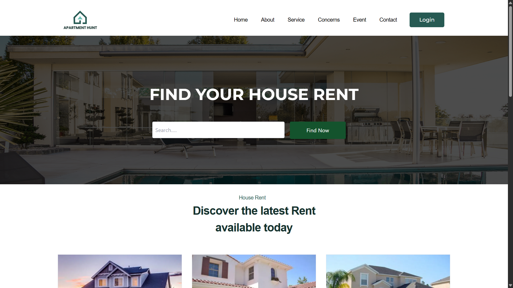

# 🏠 Apartment Hunt

**Apartment Hunt** is a modern and responsive apartment rental platform built using **Next.js** and **Tailwind CSS**. Users can browse rental listings through a clean UI designed for speed and accessibility.

> ✅ Homepage and house listings page are fully implemented with mobile-first responsive design.

---
<!--
## 🔗 Live Demo

- 🌐 [Visit Apartment Hunt (if deployed)](https://your-deployment-link.com)  
  *(Replace with actual URL when available)*

--- -->

## 📸 Preview

[Apartment Hunt Preview](Apartment_Hunt.gif) <!-- Replace with an actual screenshot or remove this line if not available -->
[Apartment Hunt Preview-1](Project_previews/preview_1.png)
[Apartment Hunt Preview-2](Project_previews/preview_2.png)
[Apartment Hunt Preview-3](Project_previews/preview_3.png)


## 🧰 Tech Stack

- ⚛️ **Next.js** – React framework for server-side rendering and routing
- 🎨 **Tailwind CSS** – Utility-first CSS framework for styling
- 🌐 **Vercel** – (Optional) Deployment platform

---

## ✨ Features

- 🏠 **Homepage** with introductory section and navigation
- 🏘️ **House for Rent Page** with property listings
- 📱 Fully **responsive layout** for all devices
- 📸 Property images and description layout (planned: detail modal or page)

---

## Installation

1. Clone the repository
```bash
git clone https://github.com/fardin-Sachi/Apartment_Hunt.git
cd Apartment_Hunt
```

2. Install Dependencies
```bash
npm install
```

3. Run the Development Server
```bash
npm run dev
```

4. Open in browser
[Visit in Browser](http://localhost:3000)

## 🚀 Build for Production
```bash
npm run build
npm run start
```

## 📌 Future Improvements]=
- 🔍 Filtering and search by location or price
- 🧑 Landlord and renter authentication
- 🗺️ Map integration using Leaflet or Google Maps API
- 💬 Contact/booking form for each listing

## 📄 License
MIT License

## 🤝 Contributions
Feel free to fork the repository and submit pull requests or issues.
